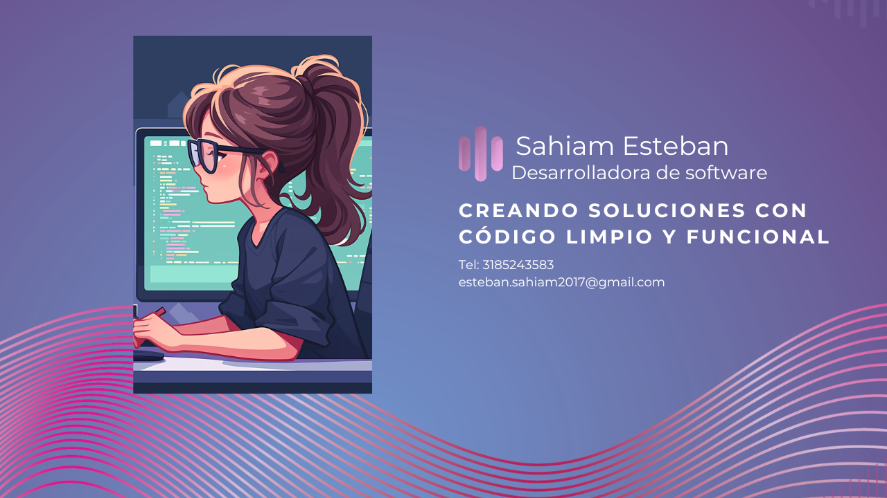

# ¡Hola! 👋 Soy Sahiam Valentina Esteban 

### Tecnologías y Herramientas

| Backend & DB | Frontend & Otros | Herramientas de Productividad |
| :--- | :--- | :--- |
|  |  |  |
|  |  |  |
|  |  |  |

---

### Habilidades Profesionales
* **Resolución de problemas:** Enfoque lógico y analítico.
* **Mentalidad orientada a resultados:** Entrega de valor en cada commit.
* **Trabajo en equipo:** Colaboración efectiva en entornos de desarrollo.
* **Gestión del tiempo:** Organización y cumplimiento de plazos.

---

### Conectemos:

---